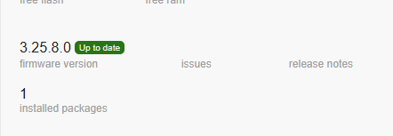
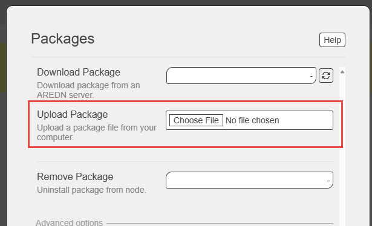

# 📞 AREDN Phonebook with Mesh Monitoring

> 🎯 **Emergency-Ready SIP Directory Service + Network Quality Monitoring for Amateur Radio Mesh Networks**

AREDN Phonebook is a SIP proxy server that provides directory services and optional network monitoring for Amateur Radio Emergency Data Network (AREDN) mesh networks. It automatically fetches and maintains a phonebook from mesh servers, while optionally monitoring network quality to help identify issues before they affect emergency communications.

## ✨ Core Features

### 📞 Phonebook Services
- 🔄 **Automatic Directory Updates**: Downloads phonebook from mesh servers every 30 minutes
- 🛡️ **Emergency Resilience**: Survives power outages with persistent storage
- 💾 **Flash-Friendly**: Minimizes writes to preserve router memory
- 🔌 **Plug-and-Play**: Works immediately after installation
- 📱 **Phone Integration**: Provides XML directory for SIP phones (tested with Yealink)
- 🔧 **Passive Safety**: Self-healing with automatic error recovery

### 📡 Network Monitoring (Optional - Enabled by Default)
- 🔍 **Agent Discovery**: Auto-discovers all phonebook servers and responders mesh-wide via OLSR topology
- 📊 **Network Probing**: RFC3550-compliant RTT, jitter, packet loss measurements to discovered agents
- 🛣️ **Hop-by-Hop Analysis**: Path quality metrics with ETX, LQ, NLQ per hop
- 🔗 **Link Classification**: Identifies RF, tunnel, ethernet, bridge links
- 🗺️ **Geographic Data**: Reports node location (lat/lon/grid square) from AREDN
- 🖥️ **Hardware Info**: Tracks device model and firmware version
- 🔄 **Multi-Protocol**: Supports both OLSR and Babel routing daemons
- 🏥 **Health Monitoring**: Software health, crashes, memory, thread responsiveness
- 🌐 **Local Access**: HTTP CGI endpoints for on-node diagnostics
- 📊 **Standard Schema**: meshmon.v1 JSON format for easy integration

## 📦 Installation

### 🔗 Download

1. Go to the [📥 Releases page](https://github.com/dhamstack/AREDN-Phonebook/releases)
2. Download the latest `AREDN-Phonebook-x.x.x-x_[architecture].ipk` file for your device:
   - 🏠 **ath79**: Most common AREDN routers (e.g., Ubiquiti, MikroTik)
   - 💻 **x86**: PC-based AREDN nodes
   - 🔧 **ipq40xx**: Some newer routers

### 🌐 Install via AREDN Web Interface

1. 🌐 **Access AREDN Node**: Connect to your AREDN node's web interface

2. ⚙️ **Navigate to Administration**: Go to **Administration** → **Package Management**

   

3. 📤 **Upload Package**:
   - Click **Choose File** and select your downloaded `.ipk` file

     

4. ⚡ **Install**: Click **Fetch and Install**

## ⚙️ Configuration (optional, not needed for most users)

The phonebook server automatically configures itself. Default settings:

- 📄 **Configuration**: `/etc/sipserver.conf`
- 🔧 **Service Commands**: `/etc/init.d/AREDN-Phonebook start|stop|restart|status`
- 🔌 **SIP Port**: 5060
- 🌐 **Directory URL**: `http://[your-node].local.mesh/arednstack/phonebook_generic_direct.xml`

## 📱 Phone Setup

Configure your SIP phone to use the node's directory:

1. 🔗 **Directory URL**: `http://localnode.local.mesh/arednstack/phonebook_generic_direct.xml`
2. 📡 **SIP Server**: `localnode.local.mesh`
3. 🔄 **Refresh**: Directory updates automatically every xx seconds from router (your Update Time Interval)

## 🔗 CGI Endpoints

### 📞 Phonebook Endpoints
- **`/cgi-bin/loadphonebook`** (GET): Triggers immediate phonebook reload
- **`/cgi-bin/showphonebook`** (GET): Returns current phonebook as JSON

### 📡 Monitoring Endpoints (Enabled by Default)
- **`/cgi-bin/health`** (GET): Agent health with location, hardware, routing daemon
  - Returns: CPU, memory, threads, health score (0-100)
  - Includes: lat/lon, grid square, hardware model, firmware version
  - Reports: routing daemon (OLSR/Babel), uptime, restart count

- **`/cgi-bin/network`** (GET): Network quality with hop-by-hop path analysis
  - Returns: RTT, jitter, packet loss per neighbor
  - Includes: Complete path reconstruction with per-hop metrics
  - Reports: ETX, LQ, NLQ, link types (RF/tunnel/ethernet)

- **`/cgi-bin/crash`** (GET): Crash history with stack traces
  - Returns: Last 5 crashes with timestamps and signals

**Example:**
```bash
# Get agent health (includes geographic location)
curl http://localnode.local.mesh/cgi-bin/health | json_pp

# Get network quality (includes hop-by-hop path data)
curl http://localnode.local.mesh/cgi-bin/network | json_pp

# Get crash history
curl http://localnode.local.mesh/cgi-bin/crash | json_pp
```

**Sample Health Response:**
```json
{
  "schema": "meshmon.v1",
  "type": "agent_health",
  "node": "HB9BLA-HAP-2",
  "routing_daemon": "olsr",
  "lat": "47.123456",
  "lon": "8.654321",
  "grid_square": "JN47xe",
  "hardware_model": "MikroTik RouterBOARD 952Ui-5ac2nD",
  "firmware_version": "3.24.10.0",
  "health_score": 100.0,
  "cpu_pct": 2.5,
  "mem_mb": 12.3
}
```

## 🔧 Troubleshooting

### ✅ Check Service Status
```bash
ps | grep AREDN-Phonebook
logread | grep "AREDN-Phonebook"
```

### 📂 Verify Directory Files
```bash
ls -la /www/arednstack/phonebook*
curl http://localhost/arednstack/phonebook_generic_direct.xml
```

### ⚠️ Common Issues

- 📅 **No directory showing**: Wait up to 30 minutes for first download
- 🚫 **Service not starting**: Check logs with `logread | tail -50`
- 🔒 **Permission errors**: Ensure `/www/arednstack/` directory exists

## 🔬 Technical Details

- 🚀 **Emergency Boot**: Loads the existing phonebook immediately on startup
- 💾 **Persistent Storage**: Survives power cycles using `/www/arednstack/`
- 🛡️ **Flash Protection**: Only writes when phonebook content changes
- 🧵 **Multi-threaded**: Background fetching doesn't affect SIP performance
- 🔧 **Auto-healing**: Recovers from network failures and corrupt data

## 📚 Documentation

- 📄 **Phonebook FSD**: [`docs/AREDN-phonebook-fsd.md`](docs/AREDN-phonebook-fsd.md) - Original phonebook implementation
- 📄 **Monitoring FSD**: [`docs/AREDN-Phonebook-With-Monitoring-FSD.md`](docs/AREDN-Phonebook-With-Monitoring-FSD.md) - Complete feature specification (Phases 0-2)
- 🏗️ **Architecture**: [`docs/AREDNmon-Architecture.md`](docs/AREDNmon-Architecture.md) - System architecture and collector design
- 🧪 **Testing Guide**: [`docs/TESTING.md`](docs/TESTING.md) - Comprehensive testing procedures for all features

## 🎯 Implementation Status

✅ **Phase 0 - Software Health** (Complete)
- Health monitoring, crash detection, memory tracking
- Geographic location and hardware info
- Health scoring (0-100)

✅ **Phase 1 - Network Monitoring** (Complete)
- UDP probe engine with RFC3550 metrics
- OLSR and Babel routing daemon support
- Agent discovery from mesh topology (auto-discovers all phonebook servers and responders)

✅ **Phase 2 - Path Analysis** (Complete)
- Hop-by-hop path reconstruction
- Per-hop ETX, LQ, NLQ metrics
- Link type classification

🔜 **Future Enhancements**
- Centralized collector for network-wide monitoring
- Web dashboard for visualization
- Historical trending and alerting

## 🆘 Support

- 🐛 **Issues**: [GitHub Issues](https://github.com/dhamstack/AREDN-Phonebook/issues)
- 🌐 **AREDN Community**: [AREDN Forums](https://www.arednmesh.org/)

## 📄 License

This project is released under open source license for amateur radio emergency communications.
